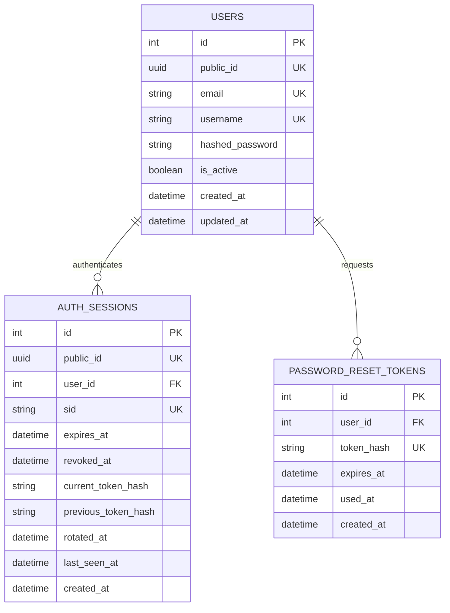
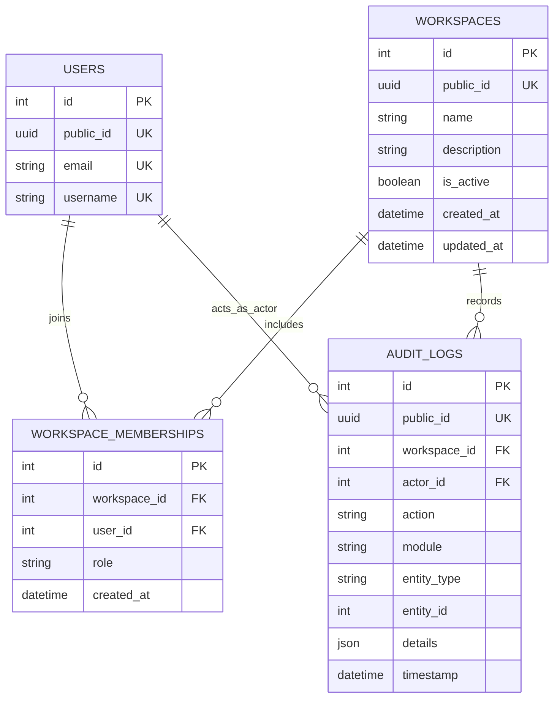
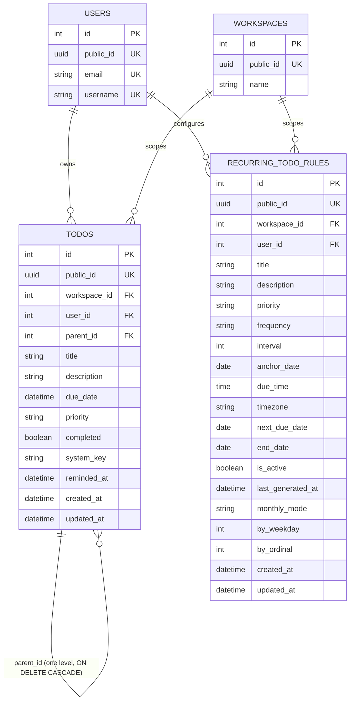
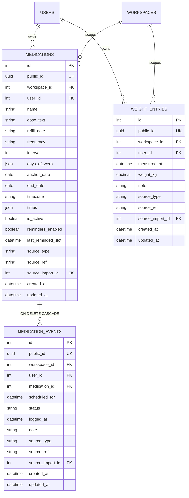
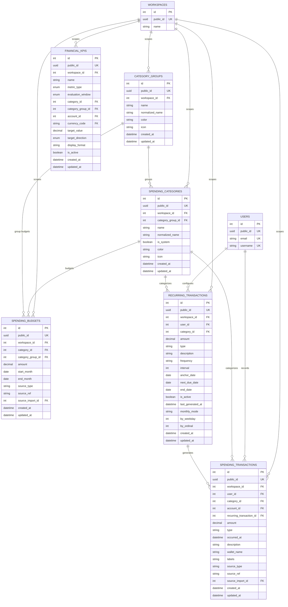
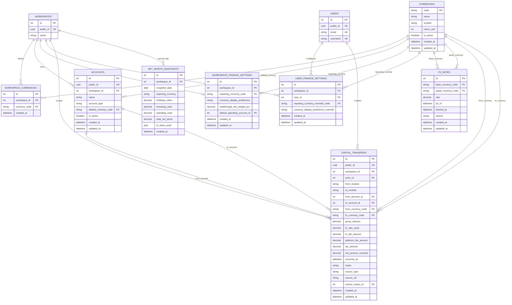
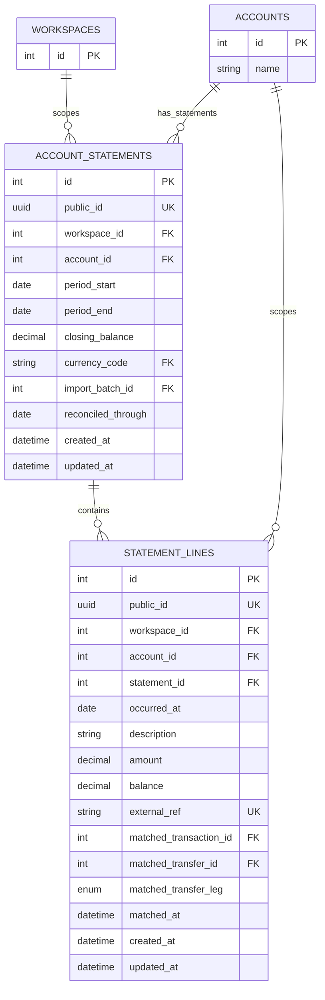
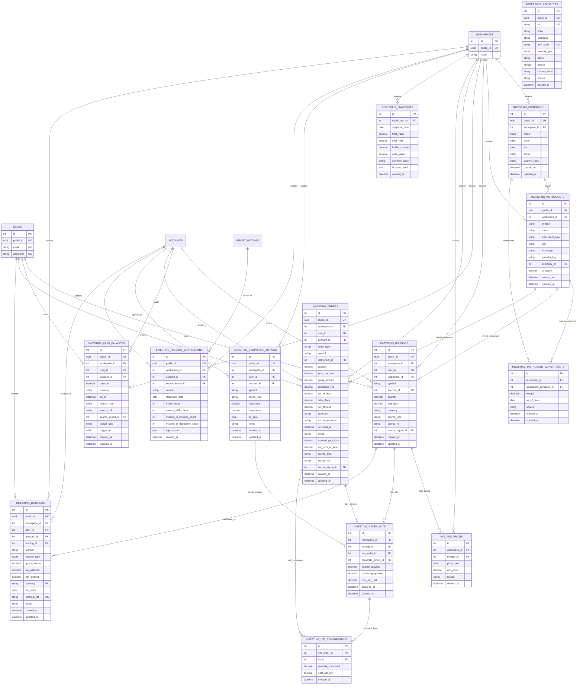
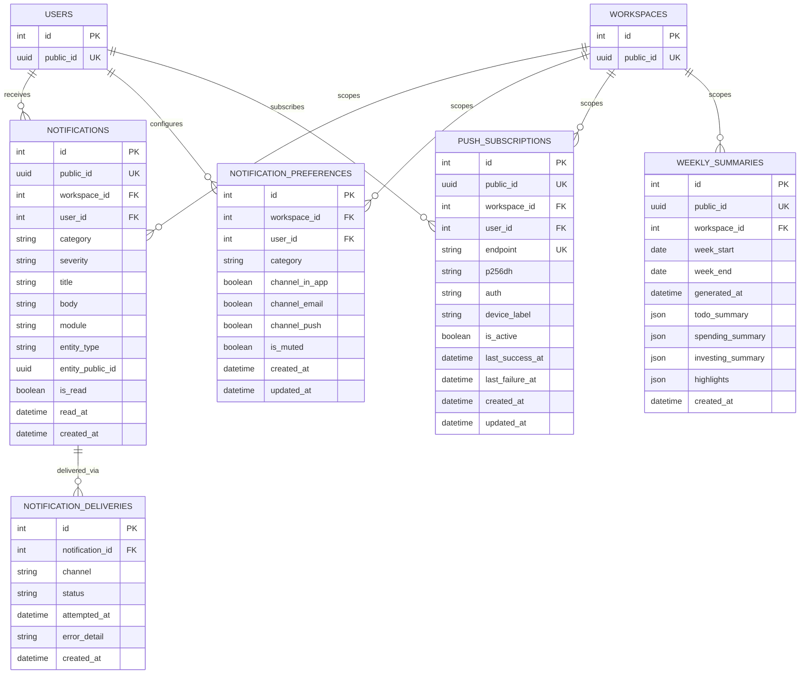
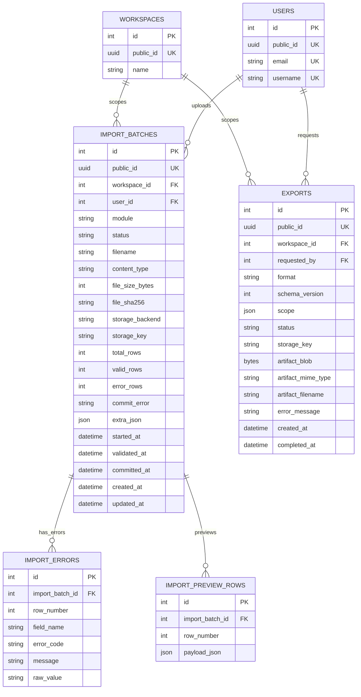

# Lifestack ER Diagrams

These diagrams are split by domain so each module is readable on its own.
Shared links to `USERS` and `WORKSPACES` are repeated where they help explain
ownership and tenant boundaries.

## Auth

## Workspace Core

## Todo

## Health (spec-069)

Medications + weight only in v1 (owner decision D9) — sleep/workouts/vitals/labs are later slices,
same table patterns. Dose slots are never stored: they're derived on read from
(frequency, interval, anchor_date, days_of_week, times, timezone, end_date) via
`app/health/schedule.py`, reusing the `RecurringTodoRule` recurrence vocabulary
(`core/recurrence.py::advance_due_date` semantics for daily/monthly, with
`days_of_week` as the one weekly extension). Every table carries the
`source_type`/`source_ref`/`source_import_id` triplet (the same pattern as
`spending_transactions`) so device sync/extraction can slot in later without
migration churn — `source_type` is always `"manual"` in v1.

A dose slot's status is computed on read (never stored): `taken`/`skipped` if a
`MEDICATION_EVENTS` row exists for that `(medication_id, scheduled_for)` slot
(unique constraint enforces one answer per slot), `pending` if in the future,
`missed` if more than `HEALTH_DOSE_GRACE_HOURS` (default 4) past with no
event. Logging late flips a missed slot to taken/skipped — no reconciliation
job needed.

## Spending

A budget scopes to exactly one of `category_id` or `category_group_id` (DB check
constraint `ck_budget_scope`), and `start_month`/`end_month` (nullable = ongoing)
replaced the old single `month_start` field so budgets can be date-ranged
(spec-064). Category delete/merge (spec-062) reassigns transactions and
recurring rules to a target category before removing the source.

## Finance

`net_worth_snapshots` is unique on `(workspace_id, snapshot_date)` and is
upserted two ways (spec-065): opportunistically on every `GET /finance/net-worth`
read for today, and by the daily `net_worth_snapshot_job` cron. Both paths
compute holdings/cash live via `InvestingSummaryService` rather than reading
the (investing-only, cache-prone) `portfolio_snapshots` table, so the job
doesn't depend on a dashboard visit having happened that day.

## Finance / Wallet Reconciliation (spec-078)

Statement matching is metadata-only — these tables never mutate `spending_transactions`,
`capital_transfers`, or `investing_cash_balances`. `reconciled_through` is informational,
not a lock.

## Investing

## Notifications & Summaries

## Imports & Exports

## Notes

- `workspace_id` is the tenant boundary for every business table.
- `public_id` is the external identifier exposed to API clients.
- `auth_sessions` stores refresh-token rotation hashes so login, refresh, and workspace selection can keep replay protection consistent.
- `spending_transactions` and `spending_budgets` enforce the `category_id + workspace_id` pairing with composite foreign keys in the database, even though Mermaid shows them as simple relationships.
- `workspace_finance_settings` is effectively one row per workspace; `user_finance_settings` stores per-user display/reporting overrides inside that workspace.
- `workspace_currencies` is the workspace-level allow-list for currencies.
- `fx_rates` stores currency pairs with both a base and quote currency reference.
- `capital_transfers` connects the spending and investing modules through accounts and currencies.
- `investing_holdings`, `investing_cash_balances`, and `investing_orders` enforce tenant-safe `account_id` relationships to the `accounts` table.
- `investing_orders` records each buy/sell trade against a brokerage account. Placing an order automatically writes a new `investing_cash_balances` row (`trigger_type="order"`) and replays the holding's FIFO lots (`investing_order_lots` / `investing_lot_consumptions`, spec-044) to recompute `avg_cost`; a transfer into an investing account writes a balance row with `trigger_type="transfer"`. `trigger_ref` points back to the order/transfer `public_id`.
- `investing_order_lots` rows are recomputed (deleted and recreated) on every holding replay. Exactly one of `buy_order_id`/`corporate_action_id` is set: a buy creates a lot; a bonus issue (spec-051) creates a zero-cost lot; a split/reverse split scales existing lots in place. `investing_lot_consumptions` is the audit trail of which lots each sell drew from.
- `investing_corporate_actions` (spec-051) are replayed alongside orders by `ex_date` and never touch `investing_cash_balances` — cash-neutral by construction.
- `notifications` fan out through `notification_deliveries` per channel; `push_subscriptions` (spec-052) stores Web Push endpoints as capability secrets (never logged, returned truncated) and is deactivated automatically on permanent push-service rejection.
- `workspace_finance_settings.default_spending_account_id` (spec-054) is the create-path fallback account for spending transactions; cleared automatically when that account is deactivated.
- `import_batches.extra_json` (spec-056) carries module-specific batch context, e.g. the CAMS CAS `target_account_id` and advisory preview signals.
- `import_batches` tracks the life of bulk data uploads for transaction and holdings modules.
- `exports` handles the user-driven data exports lifecycle.
- `reference_securities` (spec-083, migration 0053) is a **global** (no `workspace_id`) security-master table populated from the bundled `securities.json.gz` dataset (AMFI mutual funds, NSE equities/ETFs, Nasdaq/NYSE listings) and enriched on demand via the Yahoo Finance API fallback. It is the authoritative lookup for `ReferenceResolveService` when resolving ISIN/ticker/AMFI codes to a canonical security identity. The table carries conditional unique indexes: `isin` (where not null), `(ticker, exchange)` (where ticker not null), and `amfi_code` (where not null). There are no foreign keys from tenant tables into `reference_securities` — it is read-only reference data consulted during resolution and enrichment, never linked by FK.
- `investing_dividends` (spec-073) records dividend/interest/coupon income events. Each row credits `investing_cash_balances` once via the service layer — there is no offsetting debit, replacing the former workaround of a fake wallet→brokerage transfer. `holding_id` is an opportunistic link (null when the position has been exited); `income_type` is one of `dividend`/`interest`/`coupon`. A conditional unique index on `(workspace_id, account_id, external_ref)` prevents duplicate imports.
- `financial_kpis` (spec-077) stores user-defined KPI definitions (spend total, income total, net cash flow) scoped to a workspace with optional `category_id`, `category_group_id`, or `account_id` filters. Single-currency enforcement is checked at evaluation time (service layer), not as a DB constraint. Exactly one of `target_value`/`target_direction` is set (check constraint `ck_financial_kpis_target_pair`).
- `account_statements` and `statement_lines` (spec-078, wallet ledger reconciliation) are **metadata-only** — they never mutate any ledger table. A `statement_line` can be matched to at most one of `spending_transactions` or `capital_transfers` (check constraint `ck_statement_lines_exactly_one_match_target`). `account_statements.reconciled_through` is informational, not a processing lock. Duplicate statement-line detection uses the deterministic `external_ref` derived from `(account, date, amount, description, within-file index)`.
