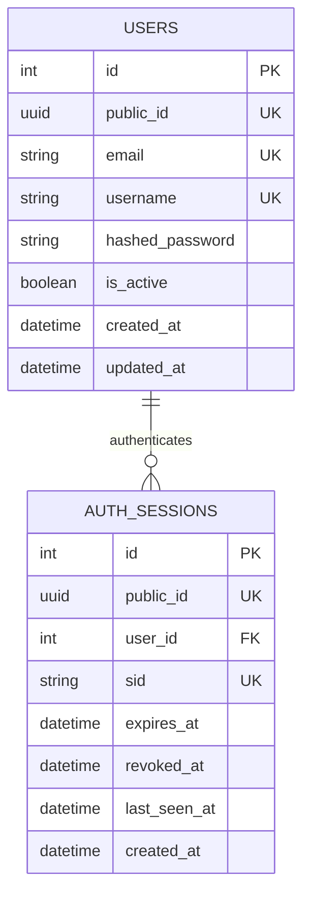
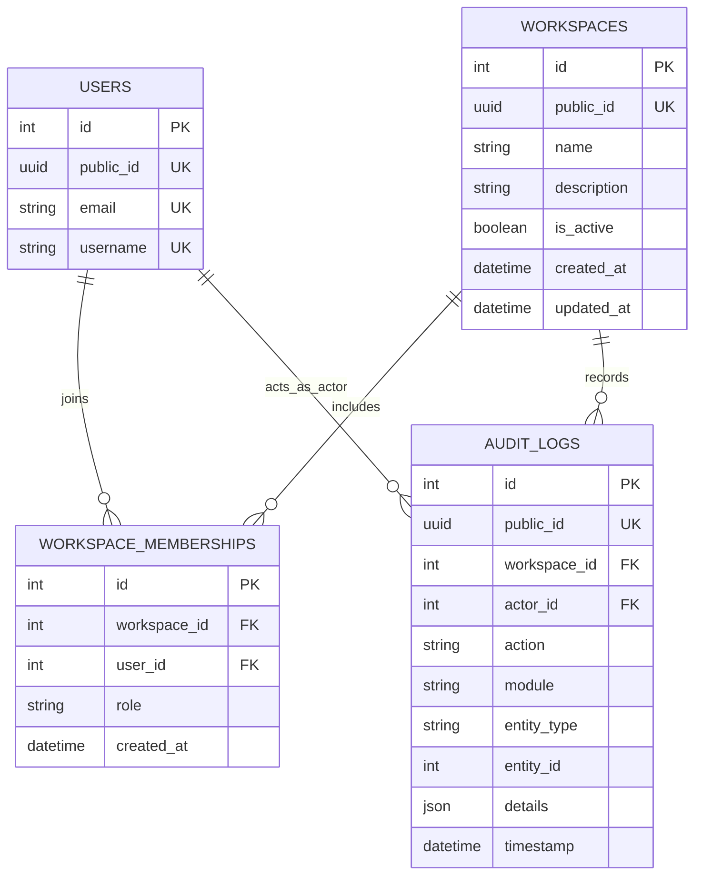
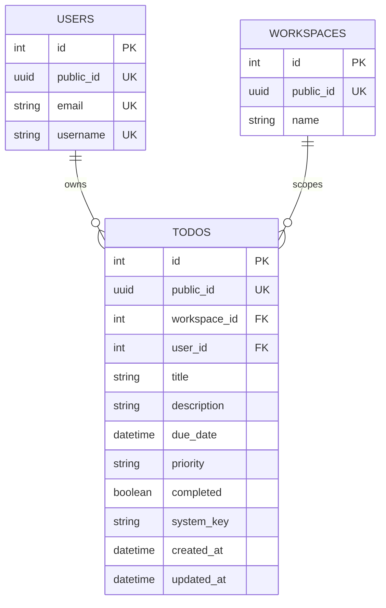
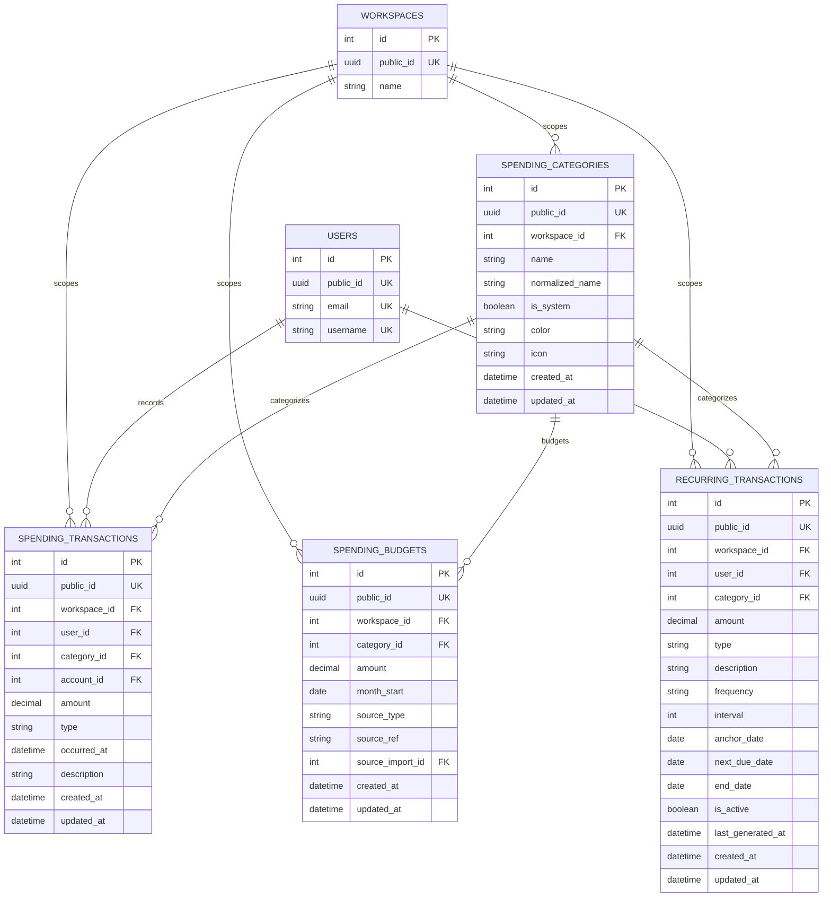
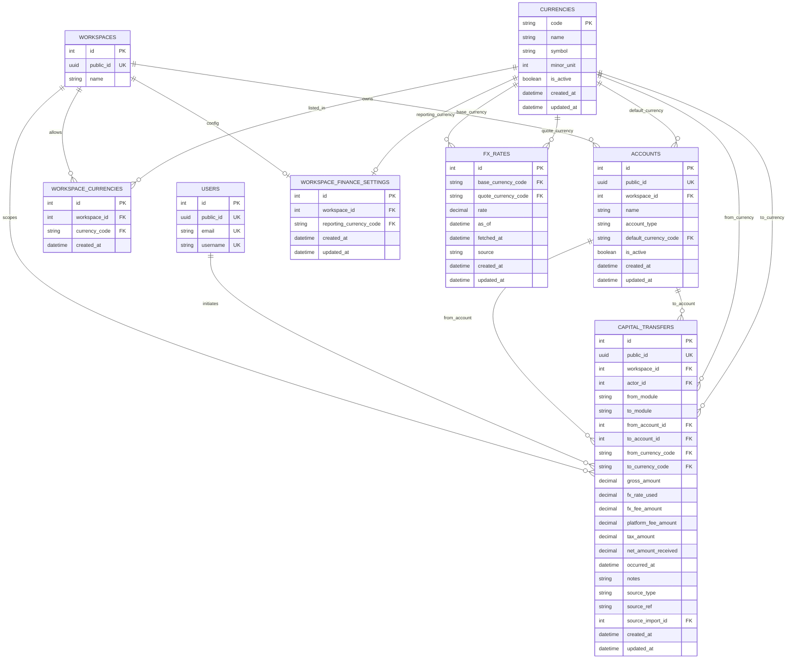
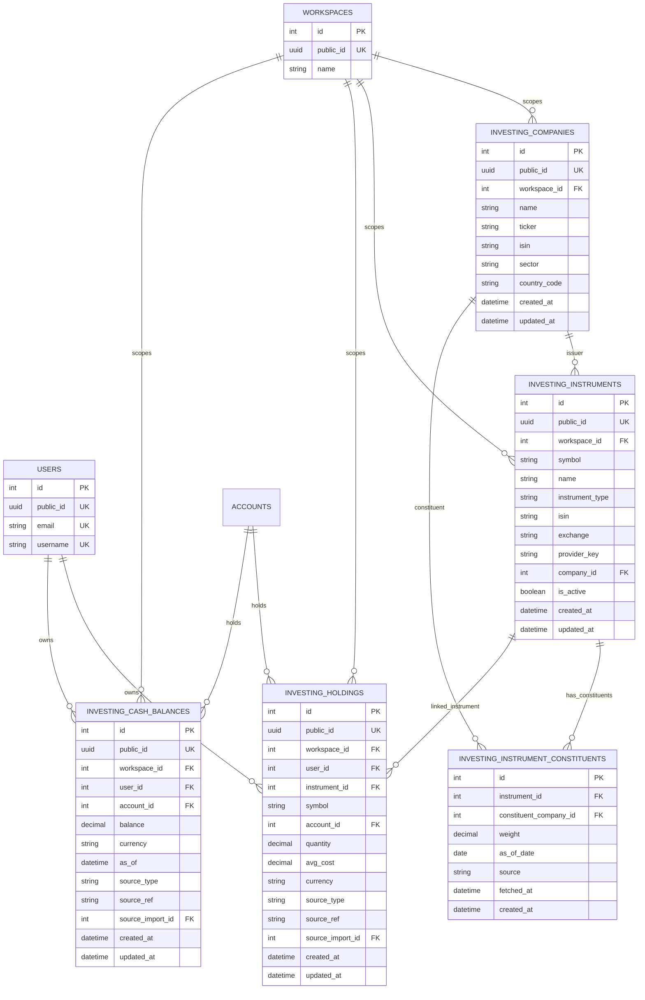
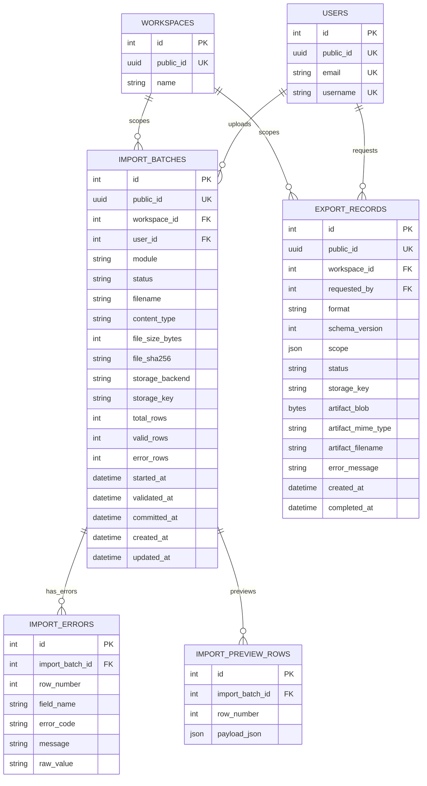

# Lifestack ER Diagrams

These diagrams are split by domain so each module is readable on its own.
Shared links to `USERS` and `WORKSPACES` are repeated where they help explain
ownership and tenant boundaries.

## Auth

## Workspace Core

## Todo

## Spending

## Finance

## Investing

## Imports & Exports

## Notes

- `workspace_id` is the tenant boundary for every business table.
- `public_id` is the external identifier exposed to API clients.
- `spending_transactions` and `spending_budgets` enforce the `category_id + workspace_id` pairing with composite foreign keys in the database, even though Mermaid shows them as simple relationships.
- `workspace_finance_settings` is effectively one row per workspace.
- `workspace_currencies` is the workspace-level allow-list for currencies.
- `fx_rates` stores currency pairs with both a base and quote currency reference.
- `capital_transfers` connects the spending and investing modules through accounts and currencies.
- `investing_holdings` and `investing_cash_balances` enforce tenant-safe `account_id` relationships to the `accounts` table.
- `import_batches` tracks the life of bulk data uploads for transaction and holdings modules.
- `exports` handles the user-driven data exports lifecycle.
